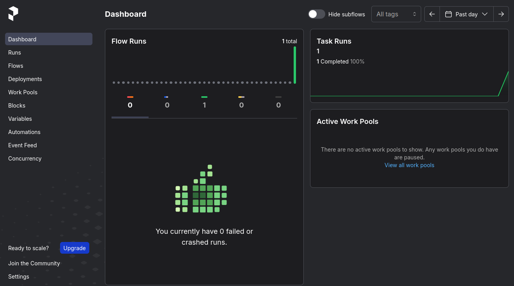
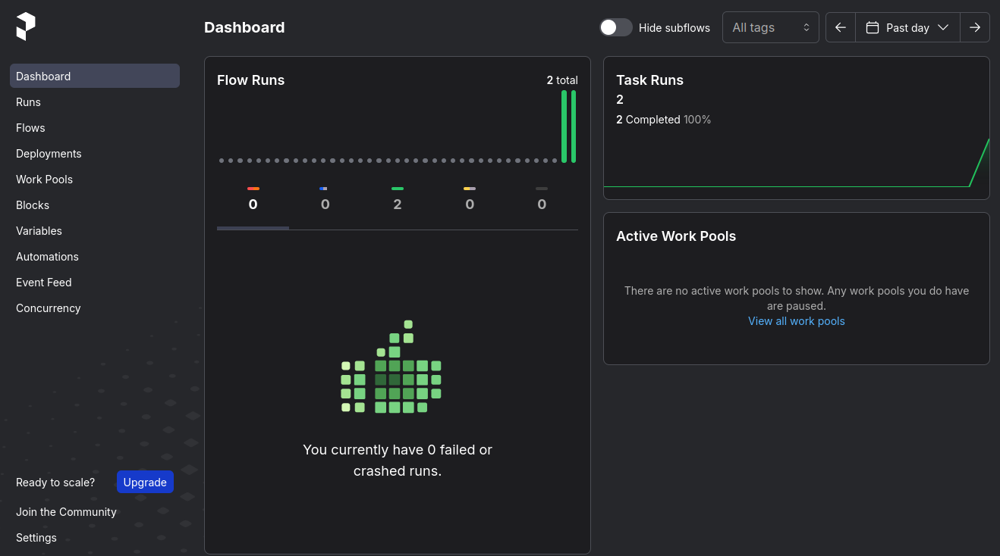
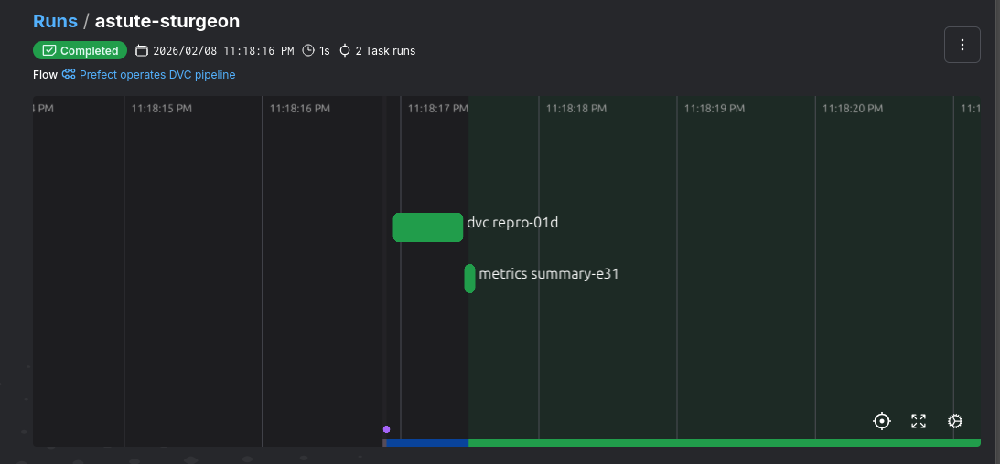
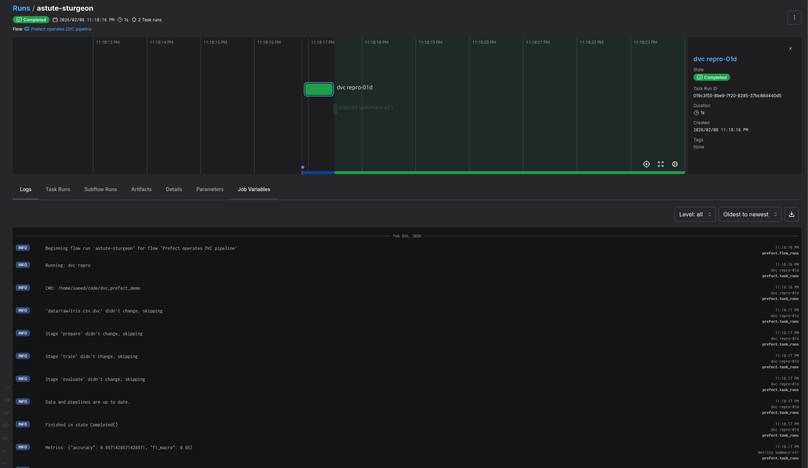
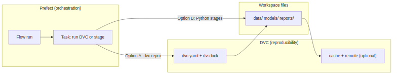
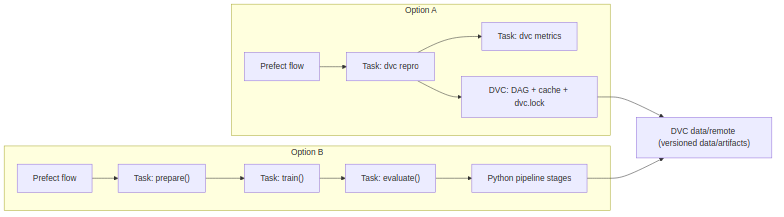

# Prefect guided tour: orchestration on top of DVC

### Quick Note

This session starts after the DVC guided tour. The repo state is assumed to be
exactly what the DVC walkthrough expects. Since this walkthrough will use `dvc repro`.  and that the steps in that walkthrough
are taken.

We will not change `dvc.yaml` or `dvc.lock` in this walkthrough. Option A uses
them as-is, and Option B bypasses them (it calls the same stage functions
directly).

## What Prefect is

Prefect is a Python-native orchestrator:

* define flows and tasks in Python
* run them with visibility (UI), logs, retries, and scheduling (not covered here)

In this demo we focus on two things:

* orchestration basics (runs, tasks, retries, UI)
* two integration styles with the same pipeline

### Start the Prefect server {.shrink}

For this walkthrough we assume a local Prefect server is already running.

```bash
prefect server start
```

For convenience we use a make target in this demo

```bash
make prefect-start
```

Server should be accessible at [http://127.0.0.1:4200/](http://127.0.0.1:4200/)

- Note: Launching the `prefect server` from terminal (directly or via `make`)
  sets "env vars" for the server process it starts, but that does not
  automatically configure the client Python process that runs the flow later. If
  your Python process imports Prefect without `PREFECT_API_URL` set, it will use
  Prefect defaults (which may not match the server config).
- This make target sets env variables that match the python-side (see
`orchestration/prefect_server_utils.py` and `Makefile`).

### Prefect mental model: Flow and Task (the API shape) {.shrink}

In Prefect we define

```python
@task
def step_x(...):
    ...

@flow
def pipeline(...):
    step_x(...)
    step_y(...)
```

A flow run is what we see in the Prefect UI.
Tasks are the nodes inside the flow run (with their own logs, timing, retries).

NOTE: tasks can run concurrently if there is no dependency between them
(typically by using `.submit()`).

### Prefect operates the DVC pipeline {.allowframebreaks}

Defining tasks and flow (see `orchestration/prefect_flows.py`)

```python
@task(name="dvc repro", retries=1, retry_delay_seconds=2)
def dvc_repro_task() -> None:
    # execute `dvc repro` using subprocess

@flow(name="Prefect operates DVC pipeline")
def dvc_pipeline_flow() -> None:
    dvc_repro_task()
```

\framebreak

Defining an entry point for the orchestration (see `orchestration/cli.py`)

```python
from .prefect_flows import dvc_pipeline_flow

def _main(argv: Sequence[str]) -> int:
    args = _parse_args(argv)
    dvc_pipeline_flow()
    return os.EX_OK

if __name__ == "__main__":
    sys.exit(_main(sys.argv[1:]))
```

\framebreak

Expected behavior:

* first run: DVC executes stages as needed
* second run (no changes): DVC skips work (up-to-date), but Prefect still shows
  a new flow run in the UI

\framebreak

First execution of the orchestrator's entry point

- nothing changed since last run of `dvc repro`

```bash
python -m orchestration.cli
```

\begingroup
\fontsize{6}{7}\selectfont
```console
22:59:51.881 | INFO    | Flow run 'shiny-malkoha' - Beginning flow run 'shiny-malkoha' for flow 'Prefect operates DVC pipeline'
22:59:51.885 | INFO    | Flow run 'shiny-malkoha' - View at http://127.0.0.1:4200/runs/flow-run/ea81ae3e-2502-4aa1-9b5b-200b4af396b4
22:59:51.904 | INFO    | Task run 'dvc repro-252' - Running: dvc repro
22:59:51.905 | INFO    | Task run 'dvc repro-252' - CWD: /home/saeed/code/dvc_prefect_demo
22:59:52.239 | INFO    | Task run 'dvc repro-252' - 'data/raw/iris.csv.dvc' didn't change, skipping
22:59:52.243 | INFO    | Task run 'dvc repro-252' - Stage 'prepare' didn't change, skipping
22:59:52.245 | INFO    | Task run 'dvc repro-252' - Stage 'train' didn't change, skipping
22:59:52.248 | INFO    | Task run 'dvc repro-252' - Stage 'evaluate' didn't change, skipping
22:59:52.249 | INFO    | Task run 'dvc repro-252' - Data and pipelines are up to date.
22:59:52.401 | INFO    | Task run 'dvc repro-252' - Finished in state Completed()
22:59:52.452 | INFO    | Flow run 'shiny-malkoha' - Finished in state Completed()
```
\endgroup

\framebreak



\framebreak

Second execution of the orchestrator's entry point (changed `split.test_size`)

\begingroup
\fontsize{6}{7}\selectfont
```console
23:04:31.965 | INFO    | Flow run 'liberal-tiger' - Beginning flow run 'liberal-tiger' for flow 'Prefect operates DVC pipeline'
23:04:31.975 | INFO    | Flow run 'liberal-tiger' - View at http://127.0.0.1:4200/runs/flow-run/0b2bdf5c-3e85-40fa-9447-1b3d80fc462e
23:04:32.000 | INFO    | Task run 'dvc repro-46f' - Running: dvc repro
23:04:32.001 | INFO    | Task run 'dvc repro-46f' - CWD: /home/saeed/code/dvc_prefect_demo
23:04:32.316 | INFO    | Task run 'dvc repro-46f' - 'data/raw/iris.csv.dvc' didn't change, skipping
23:04:32.341 | INFO    | Task run 'dvc repro-46f' - Running stage 'prepare':
23:04:32.342 | INFO    | Task run 'dvc repro-46f' - > python -m mltoy.cli prepare --raw data/raw/iris.csv --train data/processed/train.csv --test data/processed/test.csv --params params.yaml
23:04:33.630 | INFO    | Task run 'dvc repro-46f' - Updating lock file 'dvc.lock'
23:04:33.642 | INFO    | Task run 'dvc repro-46f' - Running stage 'train':
23:04:33.644 | INFO    | Task run 'dvc repro-46f' - > python -m mltoy.cli train --train data/processed/train.csv --model models/model.joblib --params params.yaml
23:04:34.781 | INFO    | Task run 'dvc repro-46f' - Updating lock file 'dvc.lock'
23:04:34.792 | INFO    | Task run 'dvc repro-46f' - Running stage 'evaluate':
23:04:34.794 | INFO    | Task run 'dvc repro-46f' - > python -m mltoy.cli evaluate --test data/processed/test.csv --model models/model.joblib --metrics reports/metrics.json --params params.yaml
23:04:36.124 | INFO    | Task run 'dvc repro-46f' - Updating lock file 'dvc.lock'
23:04:36.127 | INFO    | Task run 'dvc repro-46f' - To track the changes with git, run:
23:04:36.127 | INFO    | Task run 'dvc repro-46f' -     git add dvc.lock
23:04:36.128 | INFO    | Task run 'dvc repro-46f' - To enable auto staging, run:
23:04:36.128 | INFO    | Task run 'dvc repro-46f' -     dvc config core.autostage true
23:04:36.129 | INFO    | Task run 'dvc repro-46f' - Use `dvc push` to send your updates to remote storage.
23:04:36.361 | INFO    | Task run 'dvc repro-46f' - Finished in state Completed()
23:04:36.404 | INFO    | Flow run 'liberal-tiger' - Finished in state Completed()
```
\endgroup

\framebreak



### Prefect retries {.allowframebreaks}

Adding `fail_once` flag to `dvc_repro_task` to tell it to intentionally fail once.

```python
@task(name="dvc repro", retries=1, retry_delay_seconds=2)
def dvc_repro_task(*, fail_once: bool) -> None:
    # on the first call: `raise RuntimeError`
    # next time: `dvc repro`

@flow(name="Prefect operates DVC pipeline")
def dvc_pipeline_flow(*, fail_once: bool = False) -> None:
    """Operate the DVC pipeline via `dvc repro`."""
    dvc_repro_task(fail_once=fail_once)
```

\framebreak

Control the flag from cli args

```python
def _main(argv: Sequence[str]) -> int:
    args = _parse_args(argv)
    dvc_pipeline_flow(fail_once=args.fail_once)
    return os.EX_OK

if __name__ == "__main__":
    sys.exit(_main(sys.argv[1:]))
```

\framebreak

```bash
python -m orchestration.cli --fail-once
```

\begingroup
\fontsize{8}{9}\selectfont
```console
23:14:38.904 | INFO    | Flow run 'charming-labrador' - Beginning flow run 'charming-labrador' for flow 'Prefect operates DVC pipeline'
23:14:38.913 | INFO    | Flow run 'charming-labrador' - View at http://127.0.0.1:4200/runs/flow-run/2db12cbe-a58d-40f9-a367-649c039e8756
23:14:38.931 | INFO    | Task run 'dvc repro-033' - Task run failed with exception:
                        RuntimeError('Intentional one-time failure to demonstrate retries.')
                        - Retry 1/1 will start 2 second(s) from now
23:14:40.939 | INFO    | Task run 'dvc repro-033' - Running: dvc repro
23:14:40.942 | INFO    | Task run 'dvc repro-033' - CWD: /home/saeed/code/dvc_prefect_demo
23:14:41.288 | INFO    | Task run 'dvc repro-033' - 'data/raw/iris.csv.dvc' didn't change, skipping
23:14:41.292 | INFO    | Task run 'dvc repro-033' - Stage 'prepare' didn't change, skipping
23:14:41.295 | INFO    | Task run 'dvc repro-033' - Stage 'train' didn't change, skipping
23:14:41.297 | INFO    | Task run 'dvc repro-033' - Stage 'evaluate' didn't change, skipping
23:14:41.298 | INFO    | Task run 'dvc repro-033' - Data and pipelines are up to date.
23:14:41.459 | INFO    | Task run 'dvc repro-033' - Finished in state Completed()
23:14:41.508 | INFO    | Flow run 'charming-labrador' - Finished in state Completed()
```
\endgroup

### Adding another task {.allowframebreaks}

```python
@task(name="dvc repro", retries=1, retry_delay_seconds=2)
def dvc_repro_task() -> None:
    # execute `dvc repro` using subprocess

@task(name="metrics summary")
def metrics_summary_task() -> None:
    # log/print metrics resulted from `dvc repro`

@flow(name="Prefect operates DVC pipeline")
def dvc_pipeline_flow() -> None:
    dvc_repro_task()
    metrics_summary_task()
```

\framebreak

Flows can have conditional logic

```python
@flow(name="Prefect operates DVC pipeline")
def dvc_pipeline_flow(*, show_metrics: bool = True) -> None:
    dvc_repro_task()
    if show_metrics:
        metrics_summary_task()
```

\framebreak

```bash
python -m orchestration.cli --show_metrics
```

\begingroup
\fontsize{8}{9}\selectfont
```console
23:18:16.920 | INFO    | Flow run 'astute-sturgeon' - Beginning flow run 'astute-sturgeon' for flow 'Prefect operates DVC pipeline'
23:18:16.927 | INFO    | Flow run 'astute-sturgeon' - View at http://127.0.0.1:4200/runs/flow-run/b7095ca8-0730-4d1b-9ca2-69841f5593d3
23:18:16.950 | INFO    | Task run 'dvc repro-01d' - Running: dvc repro
23:18:16.951 | INFO    | Task run 'dvc repro-01d' - CWD: /home/saeed/code/dvc_prefect_demo
23:18:17.269 | INFO    | Task run 'dvc repro-01d' - 'data/raw/iris.csv.dvc' didn't change, skipping
23:18:17.273 | INFO    | Task run 'dvc repro-01d' - Stage 'prepare' didn't change, skipping
23:18:17.276 | INFO    | Task run 'dvc repro-01d' - Stage 'train' didn't change, skipping
23:18:17.278 | INFO    | Task run 'dvc repro-01d' - Stage 'evaluate' didn't change, skipping
23:18:17.279 | INFO    | Task run 'dvc repro-01d' - Data and pipelines are up to date.
23:18:17.459 | INFO    | Task run 'dvc repro-01d' - Finished in state Completed()
23:18:17.467 | INFO    | Task run 'metrics summary-e31'
                        - Metrics: {"accuracy": 0.8571428571428571, "f1_macro": 0.85}
23:18:17.476 | INFO    | Task run 'metrics summary-e31' - Finished in state Completed()
23:18:17.521 | INFO    | Flow run 'astute-sturgeon' - Finished in state Completed()
```
\endgroup

\framebreak



\framebreak



## DVC and Prefect integration: two paths {.shrink}

Option A (`dvc repro` is central) $\leftarrow$ **the example we just saw**

* DVC: owns the pipeline DAG and decides what is up-to-date (cache-aware)
* Prefect: operates the pipeline run (UI, retries, repeatable runs)

Option B (No use of `dvc repro`)

* Prefect: owns the DAG (tasks: prepare $\to$ train $\to$ evaluate)
* DVC: could be used for data versioning/remotes, but `dvc repro` is not part of
  the execution path in this option

**Why Option B?** Not all projects might have a DVC or use its DAG (i.e. `repro`)
for execution of the pipeline. Prefect is a generic python-native orchestration
framework, not just for ML pipeline.

### DVC and Prefect integration: architecture sketch of the two paths {.allowframebreaks}



\framebreak



### Prefect owns the stage DAG {.allowframebreaks}

Wrap "prepare" stage as a Prefect `task`

```python
from mltoy.pipeline import stage_prepare

@task(name="prepare")
def prepare_task(params_path: Path) -> None:
    stage_prepare(
        raw_csv=repo_root() / "data/raw/iris.csv",
        train_csv=repo_root() / "data/processed/train.csv",
        test_csv=repo_root() / "data/processed/test.csv",
        params=load_params(repo_root() / params_path),
    )
```

\framebreak

Wrap "train" stage as a Prefect `task`

```python
from mltoy.pipeline import stage_train

@task(name="train", retries=1, retry_delay_seconds=2)
def train_task(*, params_path: Path) -> None:
    stage_train(
        train_csv=repo_root() / "data/processed/train.csv",
        model_path=repo_root() / "models/model.joblib",
        params=load_params(repo_root() / params_path),
    )
```

\framebreak

Wrap "evaluate" stage as a Prefect `task`

```python
from mltoy.pipeline import stage_evaluate

@task(name="evaluate")
def evaluate_task(params_path: Path) -> None:
    stage_evaluate(
        test_csv=repo_root() / "data/processed/test.csv",
        model_path=repo_root() / "models/model.joblib",
        metrics_path=repo_root() / "reports/metrics.json",
        params=load_params(repo_root() / params_path),
    )
```

\framebreak

Declare the Prefect `flow` that owns the stage DAG

```python
@flow(name="Prefect owned stage DAG")
def pipeline_flow(params_path: Path) -> None:
    prepare_task(params_path=params_path)
    train_task(params_path=params_path)
    evaluate_task(params_path=params_path)
```

\framebreak

See `orchestration/prefect_flows_option_b.py` for more details.
But it is not wired in, no cli entry point ATM.

## Left out (important, but not covered)

Pulling a new dependency into your ML project might not be worth it, in order to
have it only handle your DAG and execution. But, an orchestrator is a powerful
tool that enables you **automate heavy pipelines with many features**!

* deployments (schedules, remote runners, work pools/workers)
* task caching / idempotency at Prefect level (DVC already covers this in Option A)
* concurrency and parallel runs (e.g. many trials)
* notifications and alerting